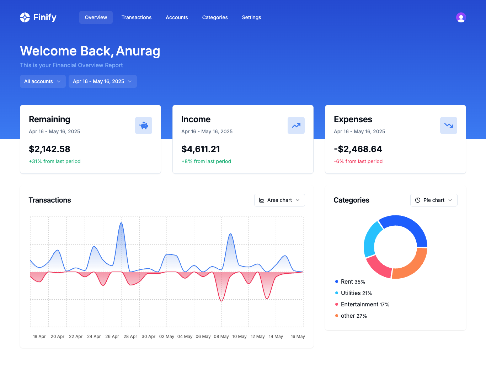

# 💰 Finify – Personal Finance Tracker

Finify is a modern web application that helps users manage their personal finances with ease. Track your earnings and expenses, categorize transactions, visualize trends with powerful charts, and gain control over your financial life.

 <!-- optional banner -->

## ✨ Features

- 🔐 **Full Authentication** – Secure user accounts powered by [Clerk.js](https://clerk.dev).
- 💸 **Track Earnings & Expenses** – Add and manage your financial transactions.
- 🏷️ **Categories** – Organize your transactions into meaningful categories.
- 📊 **Interactive Charts** – Visualize income and spending trends with:
  - Pie charts
  - Area charts  
  *(Powered by [Chart.js](https://www.chartjs.org))*
- 🔍 **Advanced Search** – Quickly find transactions by keywords, categories, or amounts.
- 📥 **CSV Import** – Bulk import transactions from your bank or other services.

## 🛠️ Tech Stack

- **Frontend:** React, Next, and Tailwind CSS
- **Backend:** Hono with Drizzle
- **Database:** Neon DB
- **Authentication:** Clerk.js
- **Charts:** Chart.js
- **State Management:** React Context 
- **File Import:** CSV Parser with React Papaparse

## 🚀 Getting Started

### Installation

1. Clone the Repository
   ```bash
   git clone https://github.com/yourusername/finify.git
   cd finify
   ```

2. Install dependencies:

   ```bash
   npm install
   ```

3. Run the development server:

    ```bash
    npm run dev
    ```

## 🙌 Contributing

Contributions are welcome! Please open an issue or submit a pull request for any improvements or suggestions.
